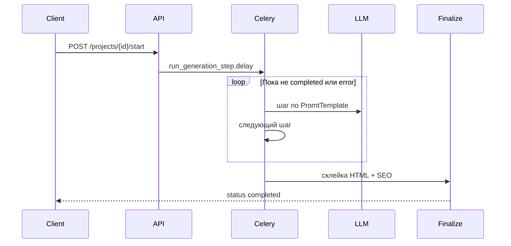

# Paper AI

Сервис для **пошаговой генерации SEO-статей** по заданным параметрам (маркер, глубина, ширина, n-граммы, число разделов, автор). Каждый проект проходит цепочку LLM-запросов в фоне (Celery + Redis), на выходе — HTML-статья и список SEO-замечаний.

Включает:

- **REST API** (django-ninja) и интерактивную документацию OpenAPI
- **Веб-интерфейс** (Django templates + HTMX + Alpine.js)
- **Импорт проектов из Excel**
- **Смету стоимости** генерации по токенам и тарифам
- **Django Admin** для шаблонов промптов, моделей и цен

---

## Содержание

- [Стек](#стек)
- [Быстрый старт (Docker)](#быстрый-старт-docker)
- [Локальная разработка](#локальная-разработка)
- [Переменные окружения](#переменные-окружения)
- [Веб-интерфейс](#веб-интерфейс)
- [Импорт из Excel](#импорт-из-excel)
- [REST API](#rest-api)
- [Генерация статьи](#генерация-статьи)
- [Смета и стоимость](#смета-и-стоимость)
- [Настройка в админке](#настройка-в-админке)
- [Структура проекта](#структура-проекта)
- [Тесты](#тесты)

---

## Стек

| Компонент | Технология |
|-----------|------------|
| Backend | Python 3.13, Django 6 |
| API | django-ninja |
| Очередь задач | Celery 5 + Redis |
| LLM | OpenAI API (или заглушка без ключа) |
| Подсчёт токенов | tiktoken |
| Excel | openpyxl |
| БД | SQLite (по умолчанию) |
| UI | Django templates, HTMX, Alpine.js |

---

## Быстрый старт (Docker)

**Требования:** Docker, Docker Compose.

```bash
cp .env.example .env
# При необходимости укажите OPENAI_API_KEY в .env

docker compose up -d --build
```

После старта:

| Сервис | URL |
|--------|-----|
| Веб-интерфейс | http://localhost:8000/ |
| API / Swagger | http://localhost:8000/api/docs |
| Django Admin | http://localhost:8000/admin/ |

Контейнеры:

- **web** — Django (`runserver`)
- **celery** — воркер генерации (обязателен для запуска статей)
- **redis** — брокер Celery

При первом запуске entrypoint выполняет `poetry install` и `migrate`. Код и `pyproject.toml` смонтированы в контейнер — после смены зависимостей достаточно перезапустить `web`/`celery` или пересобрать образ:

```bash
docker compose up -d --build
```

**Суперпользователь для админки:**

```bash
docker compose exec web poetry run python manage.py createsuperuser
```

---

## Локальная разработка

**Требования:** Python 3.13+, Poetry, Redis (локально или в Docker только для Redis).

```bash
cp .env.example .env
poetry install
poetry run python manage.py migrate
poetry run python manage.py createsuperuser
```

Терминал 1 — Django:

```bash
poetry run python manage.py runserver
```

Терминал 2 — Celery:

```bash
poetry run celery -A paper_ai.config worker --loglevel=info
```

Терминал 3 (опционально) — только Redis:

```bash
docker compose up -d redis
```

В `.env` для локального Celery укажите `CELERY_BROKER_URL=redis://localhost:6379/0`.

---

## Переменные окружения

Скопируйте `.env.example` в `.env`.

| Переменная | Описание | По умолчанию |
|------------|----------|--------------|
| `DJANGO_SECRET_KEY` | Секрет Django | (dev-значение в settings) |
| `DJANGO_DEBUG` | Режим отладки | `True` |
| `DJANGO_ALLOWED_HOSTS` | Разрешённые хосты через запятую | `localhost,127.0.0.1` |
| `DATABASE_PATH` | Путь к SQLite | `db.sqlite3` (в Docker: `/app/data/db.sqlite3`) |
| `CELERY_BROKER_URL` | Redis для Celery | `redis://localhost:6379/0` |
| `CELERY_RESULT_BACKEND` | Backend результатов Celery | как broker |
| `OPENAI_API_KEY` | Ключ OpenAI | пусто → используется **FakeLLMClient** (тестовые ответы) |

Без `OPENAI_API_KEY` пайплайн отрабатывает на заглушке — удобно для разработки UI и интеграций без расхода токенов.

---

## Веб-интерфейс

Главная страница: **http://localhost:8000/**

### Дашборд

- Таблица всех проектов (статус, смета, фактическая стоимость)
- Создание проекта, импорт Excel
- Массовые действия: **смета** и **запуск генерации** для отмеченных чекбоксами
- Автообновление таблицы каждые 3 с, пока есть проекты в процессе генерации

### Карточка проекта

- Пересчёт сметы, запуск генерации
- Превью готовой HTML-статьи
- Скачивание HTML и копирование в буфер
- SEO-замечания после финализации
- Редактирование параметров (кроме времени активной генерации)

### Форма проекта

Поля соответствуют модели проекта:

- **Маркер** — тема / ключевая фраза статьи
- **Глубина** — пары «ключевое слово + целевое число вхождений»
- **Ширина** — LSI-слова (через запятую или с новой строки)
- **N-граммы** — фразы для SEO
- **Количество разделов** — число глав (1–20)
- **О авторе** — блок для промпта
- **LLM-модель** — из справочника в админке

---

## Импорт из Excel

Формат: файл **`.xlsx`**, первая строка — заголовки, каждая следующая непустая строка — один проект.

### Колонки

| Колонка | Обязательная | Поле проекта | Формат |
|---------|:------------:|--------------|--------|
| маркер | да | `marker` | Текст, 2–100 символов |
| глубина | да | `depth` | `слово 30, другое 20` — пары «слово + число» через запятую |
| ширина | да | `width` | Слова через запятую |
| n-грамма | да | `n_gramms` | Фразы через запятую |
| кол-во разделов | да | `count_chapters` | Целое 1–20 |
| блок о авторе | да | `about_author` | Текст, 2–300 символов |
| модель | нет | `llm_model` | Название из админки (`model_name`), системное имя (`model_system_name`) или числовой `id` |

Допустимые синонимы заголовков (без учёта регистра):

- `n_грамма`, `количество разделов`, `о авторе`
- для модели: `model`, `llm`, `llm-модель`, `llm модель`

### Приоритет выбора LLM при импорте

1. Значение в колонке **модель** в строке Excel  
2. Иначе — модель из выпадающего списка на дашборде («LLM по умолчанию»)  
3. Иначе — проект без привязанной модели (генерация и смета потребуют выбрать модель позже)

Ошибки по строкам не отменяют импорт остальных: в ответе API и во flash-сообщениях UI будут перечислены проблемные строки.

### Пример строки

| маркер | глубина | ширина | n-грамма | кол-во разделов | блок о авторе | модель |
|--------|---------|--------|----------|-----------------|---------------|--------|
| Управленческий учет | учета 30, управленческий 20 | документы, расходы, доходы | управленческий учет, … | 5 | Иван Иванов, эксперт | gpt-4o-mini |

---

## REST API

Базовый префикс: **`/api/projects`**

Документация: **http://localhost:8000/api/docs**

### Проекты

| Метод | Путь | Описание |
|-------|------|----------|
| `GET` | `/api/projects` | Список (`limit`, `offset`, `status`) |
| `POST` | `/api/projects` | Создать проект |
| `GET` | `/api/projects/{id}` | Получить проект со статьёй и costs |
| `PUT` | `/api/projects/{id}` | Обновить (нельзя во время генерации) |
| `DELETE` | `/api/projects/{id}` | Удалить проект и статью |
| `POST` | `/api/projects/import` | Импорт `.xlsx` (`multipart`: `file`, опционально `llm_model_id`) |
| `GET` | `/api/projects/llm-models` | Справочник LLM-моделей |

### Генерация и экспорт

| Метод | Путь | Описание |
|-------|------|----------|
| `POST` | `/api/projects/{id}/estimate` | Рассчитать смету |
| `POST` | `/api/projects/{id}/start` | Запустить генерацию (Celery) |
| `GET` | `/api/projects/{id}/article.html` | Скачать HTML статьи |
| `POST` | `/api/projects/bulk/estimate` | Смета для списка id |
| `POST` | `/api/projects/bulk/start` | Генерация для списка id |

### Тело создания / обновления (JSON)

```json
{
  "marker": "Тема статьи",
  "depth": [
    {"keyword": "учет", "count": 30},
    {"keyword": "бизнес", "count": 10}
  ],
  "width": ["документы", "расходы"],
  "n_gramms": ["управленческий учет"],
  "count_chapters": 5,
  "about_author": "Имя, должность",
  "llm_model_id": 1
}
```

---

## Генерация статьи



### Шаги пайплайна

1. **generate_title** — заголовок  
2. **generate_introduction** — введение  
3. **generate_chapters_name** — названия глав  
4. **generate_chapters_content** — текст каждой главы (по одной задаче Celery на главу)  
5. **finalize** — сборка `final_article`, SEO-анализ → статус **completed**

### Статусы проекта

| Статус | Значение |
|--------|----------|
| `new` | Только что создан |
| `not_started` | Готов к запуску |
| `generate_title` … `generate_chapters_content` | Идёт генерация |
| `completed` | Статья готова |
| `error` | Ошибка |
| `cancelled` | Отменён |

Повторный запуск возможен из `completed`, `error`, `cancelled`, `new`, `not_started` (см. политику в `generation/policies.py`).

> Для генерации и сметы у проекта должна быть выбрана **LLM-модель** и настроены **шаблоны промптов** и **цены токенов** в админке.

---

## Смета и стоимость

- **Смета** (`estimated_cost_*`) — оценка до запуска: сумма по всем шагам пайплайна, для глав умножается на `count_chapters`. Output-токены оцениваются как `input_tokens × expected_output_ratio` шаблона (`PromtTemplate`).
- **Факт** (`cost_*`) — накапливается по реальному usage от API после каждого LLM-шага.

Пересчёт сметы: `POST /api/projects/{id}/estimate` или кнопка в UI / админке.

---

## Настройка в админке

**http://localhost:8000/admin/**

Перед первой генерацией настройте:

### 1. LLM Models

Модели для выбора в проектах. Поля:

- `model_name` — отображаемое имя (его можно указывать в Excel в колонке «модель»)
- `model_system_name` — идентификатор для OpenAI / tiktoken (например `gpt-4o-mini`)

### 2. Llm Token Price

Тарифы на `model_system_name`: цена input/output за `per_count_tokens` токенов.

### 3. Promt Template

Шаблон промпта для каждого шага генерации (`status`). В тексте — плейсхолдеры `{marker}`, `{depth}`, `{width}`, `{n_gramms}`, `{count_chapters}`, `{about_author}`, `{chapter_index}` и др.

Поле **expected_output_ratio** — доля output-токенов от input для сметы (например `0.1` ≈ ответ в 10 раз короче промпта по токенам).

Обязательные шаблоны для шагов:

- `generate_title`
- `generate_introduction`
- `generate_chapters_name`
- `generate_chapters_content`

---

## Структура проекта

```
paper_ai/
├── manage.py
├── docker-compose.yml
├── Dockerfile
├── pyproject.toml
├── .env.example
└── src/paper_ai/
    ├── config/              # settings, urls, celery, wsgi
    └── apps/articles/
        ├── models.py          # ArticleProject, ArticlePaper, PromtTemplate, …
        ├── validation.py      # лимиты полей проекта
        ├── api/               # django-ninja routes + schemas
        ├── services/          # бизнес-логика
        │   ├── project.py
        │   ├── generation.py
        │   ├── excel_import.py
        │   └── finalize.py
        ├── generation/        # статусы, шаги, политики
        ├── llm/               # OpenAI + fake client
        ├── tasks.py           # Celery
        ├── views_ui.py        # веб-интерфейс
        ├── templates/
        └── tests/
```

Подробнее о слоях: [`src/paper_ai/apps/articles/ARCHITECTURE.md`](src/paper_ai/apps/articles/ARCHITECTURE.md).

---

## Тесты

```bash
poetry run python manage.py test paper_ai.apps.articles.tests
```

Покрытие включает: валидацию, парсер Excel, API (список, импорт, обновление), расчёт сметы и токенов, стоимость генерации.

---

## Частые проблемы

### `ModuleNotFoundError: No module named 'openpyxl'` в Docker

Образ собран до добавления зависимости. Выполните:

```bash
docker compose up -d --build
```

### Генерация не стартует

- Запущен ли контейнер/процесс **celery**?
- У проекта выбрана **LLM-модель**?
- В админке есть **PromtTemplate** и **LlmTokenPrice** для этой модели?

### Пустые поля «глубина» в форме

Обновите страницу (исправлена передача данных в Alpine.js через `json_script`). Если проблема остаётся — жёсткое обновление кэша браузера.

### Смета = 0 или ошибка 400 при estimate

Проверьте `llm_model_id` и наличие цен токенов для `model_system_name` модели.

---

## Лицензия

Проект для внутреннего использования. Уточните лицензию у владельца репозитория при публикации.
